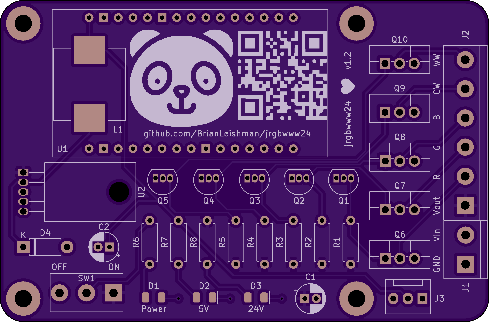
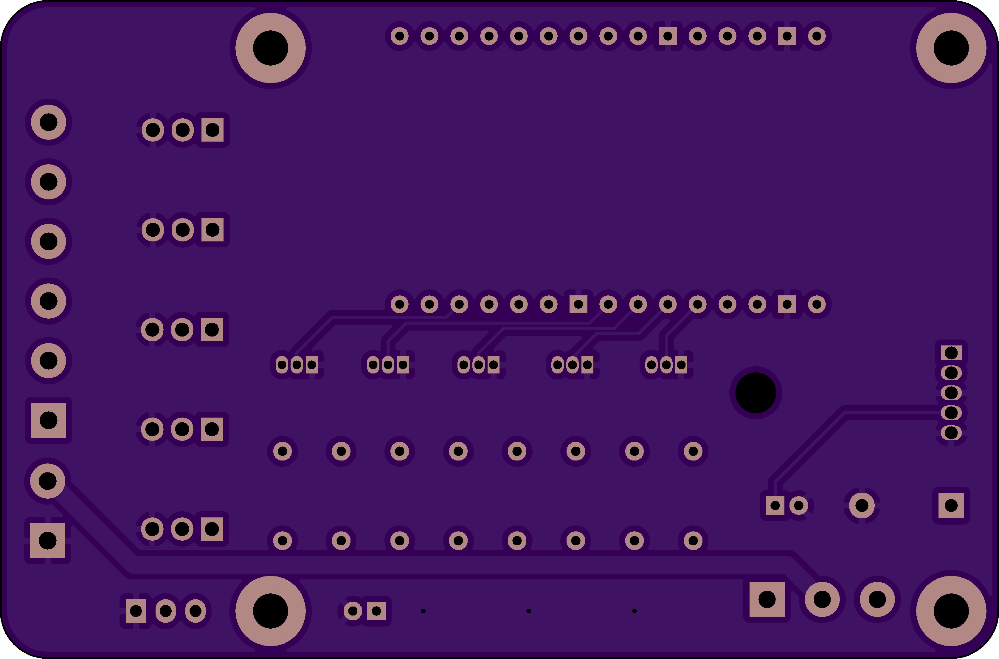

# jrgbwww24 - esp8266 board for controlling RGB W WW 24V LED strips

This PCB is designed to take esp8266 NodeMCU boards and allow them to control 24V LED strips that have RGB, cool white, and warm white LEDs.

This board is also designed to power the esp8266 board with 5V, so no USB connection is needed. Another cool feature is that this board has a 5V fan header (like a computer motherboard would), so you can plug in a fan like [this Noctua one](https://amzn.to/3mTPDOA) in case some cooling is needed.

PCB dimensions and screw holes are designed to be an exact match to a Raspberry Pi 4, for compatibility with Pi accessories like enclosures or cases.

## Heads up!

The circuits for each color channel are inverted, so make sure you specify `inverted: True` in your esphome config, for example. You can check a full example config [below](#example-esphome-config).

# Renders





# Example esphome config

```yaml
esphome:
  name: kitchen-under-cabinet-1
  platform: ESP8266
  board: nodemcuv2

# Enable logging
logger:

# Enable Home Assistant API
api:
  password: "mypassword"

ota:
  password: "mypassword"

wifi:
  ssid: "My Internet"
  password: "wifi password"
  manual_ip:
    static_ip: 192.168.1.50
    gateway: 192.168.1.1
    subnet: 255.255.255.0

  # Enable fallback hotspot (captive portal) in case wifi connection fails
  ap:
    ssid: "Rgbww Fallback Hotspot"
    password: "ZiNHD3xPr345s7UL"

captive_portal:

#RGB CoolWhite WarmWhite
output:
  - platform: esp8266_pwm
    pin: 4
    frequency: 1000 Hz
    id: pwm_r
    inverted: True
  - platform: esp8266_pwm
    pin: 14
    frequency: 1000 Hz
    id: pwm_g
    inverted: True
  - platform: esp8266_pwm
    pin: 12
    frequency: 1000 Hz
    id: pwm_b
    inverted: True
  - platform: esp8266_pwm
    pin: 13
    frequency: 1000 Hz
    id: pwm_cw
    inverted: True
  - platform: esp8266_pwm
    pin: 15
    frequency: 1000 Hz
    id: pwm_ww
    inverted: True
light:
  - platform: rgbww
    name: "K Light"
    red: pwm_r
    green: pwm_g
    blue: pwm_b
    cold_white: pwm_cw
    warm_white: pwm_ww
    cold_white_color_temperature: 6500 K
    warm_white_color_temperature: 3000 K
    color_interlock: True
```